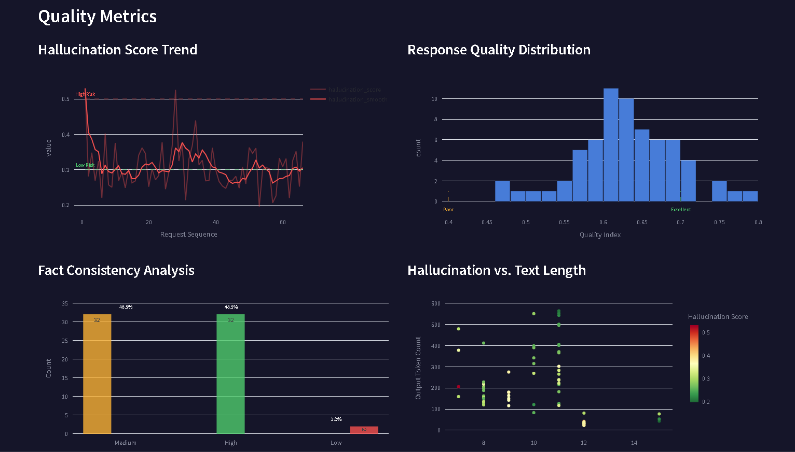
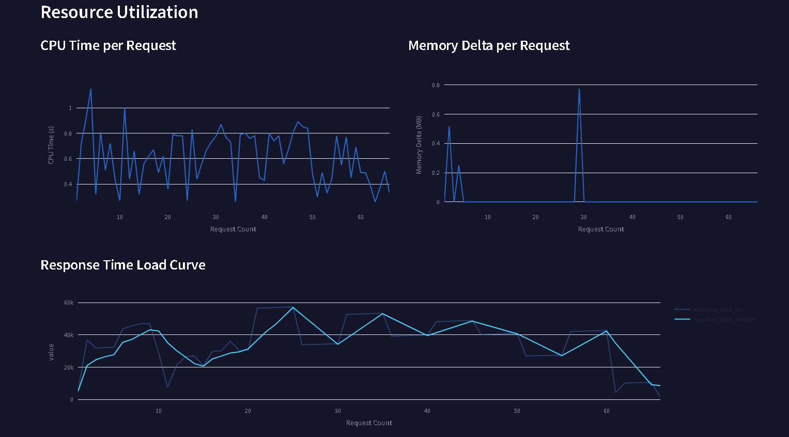
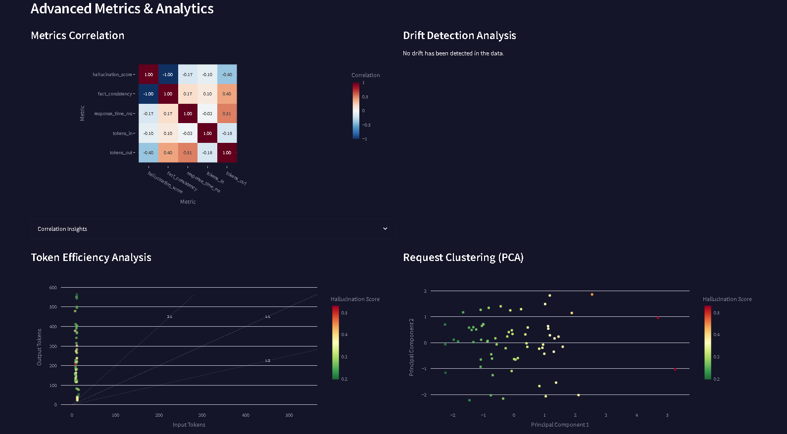

# Chart Guide & Example Insights

This document describes each chart in the AuditAI Streamlit dashboard, its goal, and an example deduction you might draw from it.

---

## 1. Key Performance Indicators (KPIs)

**Goal:** Provide a quick at-a-glance summary of critical service metrics (total requests, average latency, hallucination risk, fact consistency, CPU time, memory churn, token efficiency).

**Example Deduction:** If average latency spikes above 2000 ms while CPU time remains stable, you might infer network or I/O bottlenecks rather than pure compute issues.

---

## 2. Hallucination Score Trend

**Goal:** Show how the average hallucination score evolves over the sequence of requests, using a rolling average to smooth noise.

**Example Deduction:** A rising trend of hallucination scores under high load could indicate model degradation when resource‐constrained, prompting a scale‐up of compute or model tuning.

---

## 3. Response Quality Distribution

**Goal:** Visualize the spread of the composite `response_quality_index` across all inferences to identify outliers and overall quality consistency.

**Example Deduction:** A heavy tail of low‐quality responses suggests occasional model failures; you could investigate logs for specific prompts that triggered them.

---

## 4. Hallucination vs. Token Counts

**Goal:** Correlate prompt length (`tokens_in`) with output size (`tokens_out`) and color‐code points by hallucination risk to reveal size–error patterns.

**Example Deduction:** If short prompts produce disproportionately high hallucination scores, you may need to adjust prompt engineering or minimum context length.

---

## 5. Resource Utilization

### 5.1 CPU Time per Request

**Goal:** Plot per‐inference CPU seconds to track compute cost and detect anomalies.

**Example Deduction:** A sudden jump in CPU time at request #150 could indicate a complex prompt or garbage-in data requiring more compute.

### 5.2 Memory Delta per Request

**Goal:** Display memory churn (MB) for each call to detect leaks or abnormal allocations.

**Example Deduction:** Gradually increasing memory deltas over a test run could signal a memory leak in your inference service.

### 5.3 Response Time Load Curve

**Goal:** Compare raw latency vs. smoothed trend to understand performance under sustained load.

**Example Deduction:** If the smooth trend line gently rises as concurrency increases, it indicates acceptable scaling; a sharp incline would signal capacity limits.

### 5.4 Model Comparison

**Goal:** Compare different models side by side on metrics like CPU time, memory delta, latency, and hallucination score.

**Example Deduction:** If Model A uses 50% less CPU time but has 10% higher hallucination risk than Model B, you can choose between cost‐efficiency or accuracy based on priorities.

---

## 6. Advanced Analytics

### 6.1 Correlation Heatmap

**Goal:** Show pairwise correlations between numeric metrics to identify related behaviors (e.g., latency vs. hallucination).

**Example Deduction:** A strong positive correlation between `response_time_ms` and `hallucination_score` might suggest that longer inferences also risk more hallucination.

### 6.2 Drift Detection Analysis

**Goal:** Plot hallucination scores over requests with drift-flag markers to highlight when distributional shifts occur.

**Example Deduction:** If drift flags occur after a version upgrade, it may indicate a model behavior change that warrants new baseline calibration.

### 6.3 Token Efficiency Analysis

**Goal:** Bar or scatter of `token_efficiency` (output/input ratio) over time or by model to measure cost effectiveness.

**Example Deduction:** A drop in efficiency during peak hours could uncover payloads generating shorter outputs and prompting prompt adjustments.

### 6.4 PCA Dimensionality Reduction

**Goal:** Perform PCA on numeric features to cluster inferences and detect grouping patterns or anomalies.

**Example Deduction:** A distinct cluster of points far from the main group may represent outlier requests that deserve further investigation.

